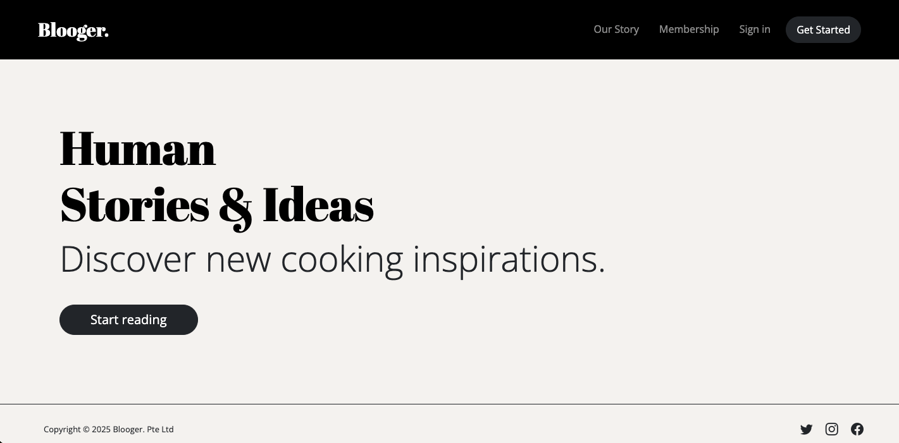
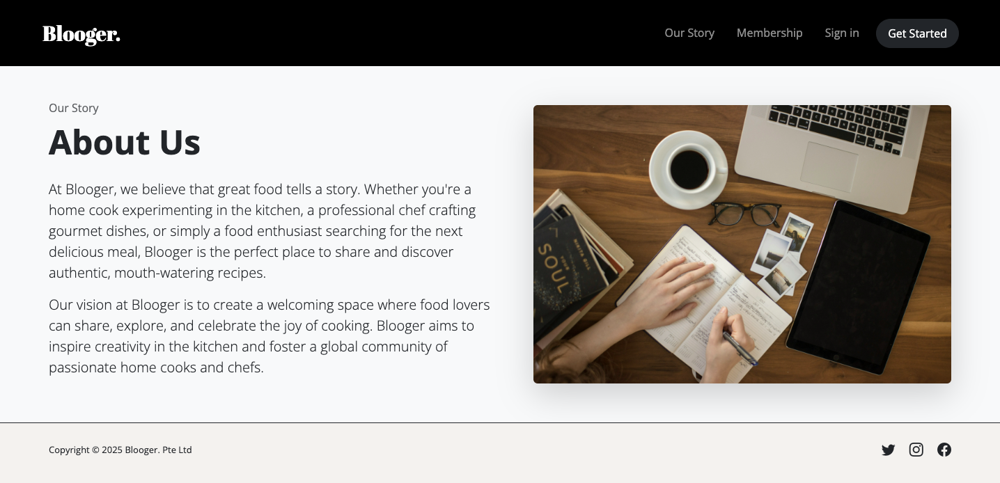
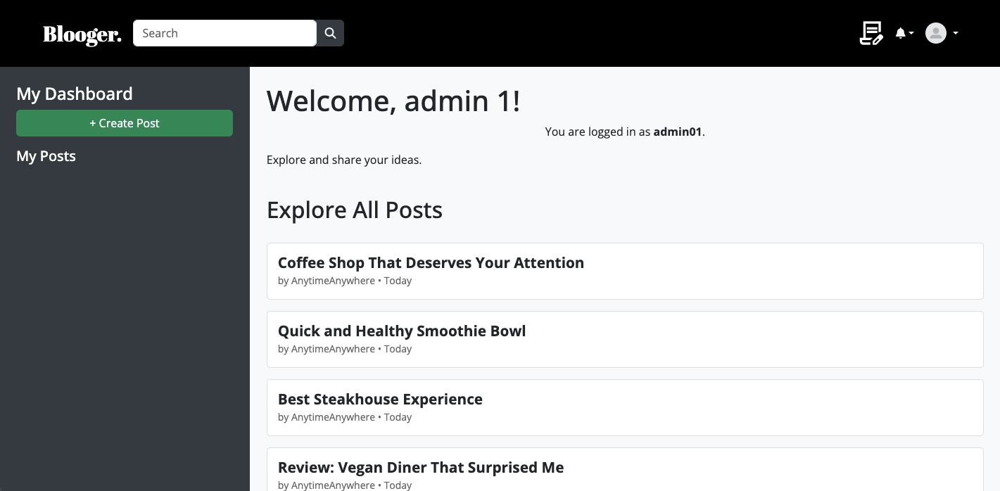
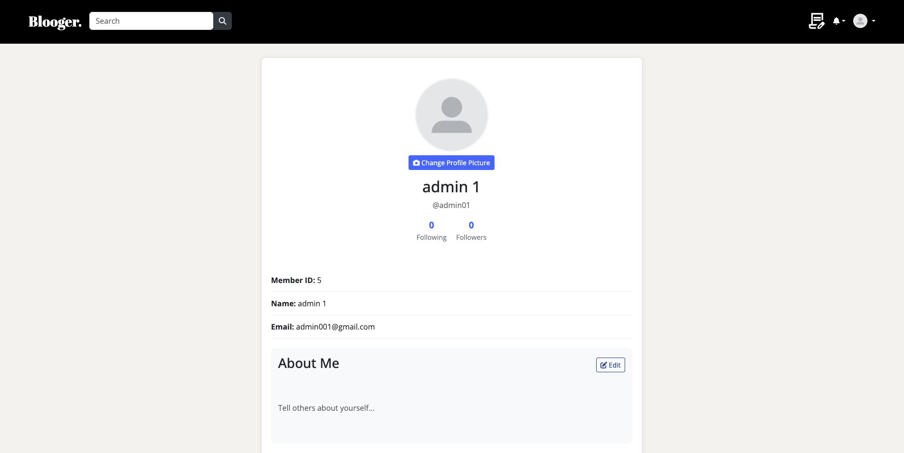
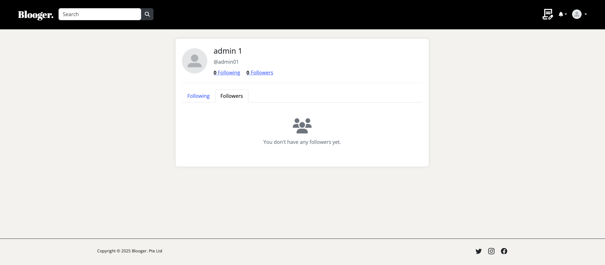
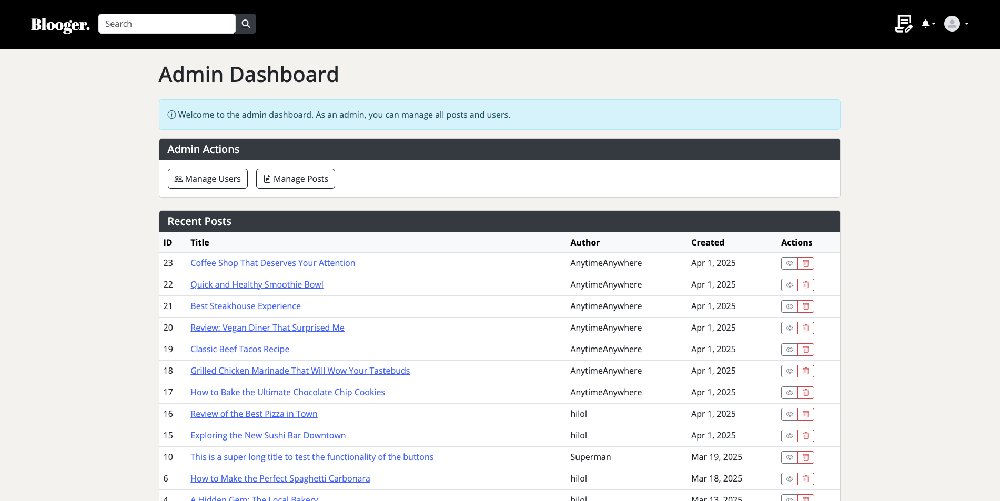
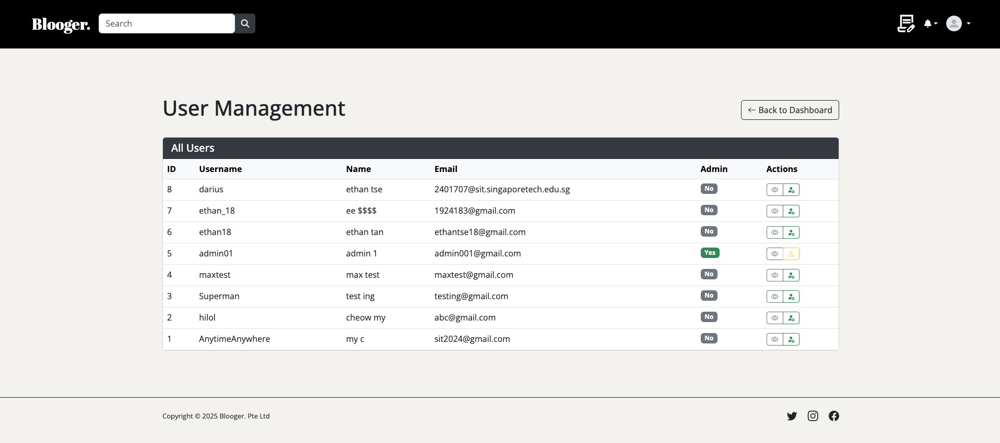
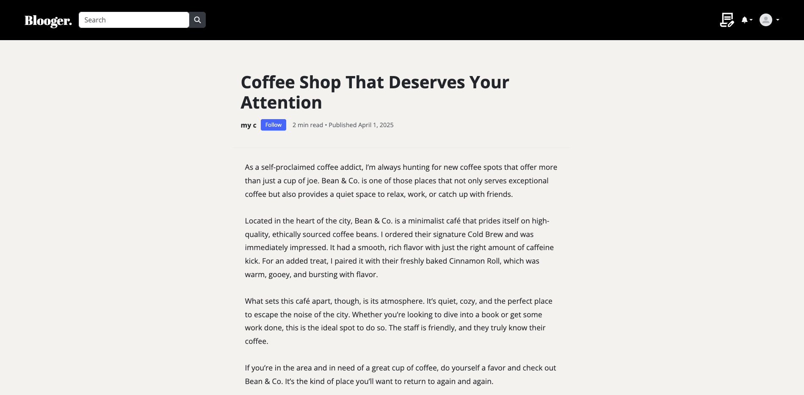
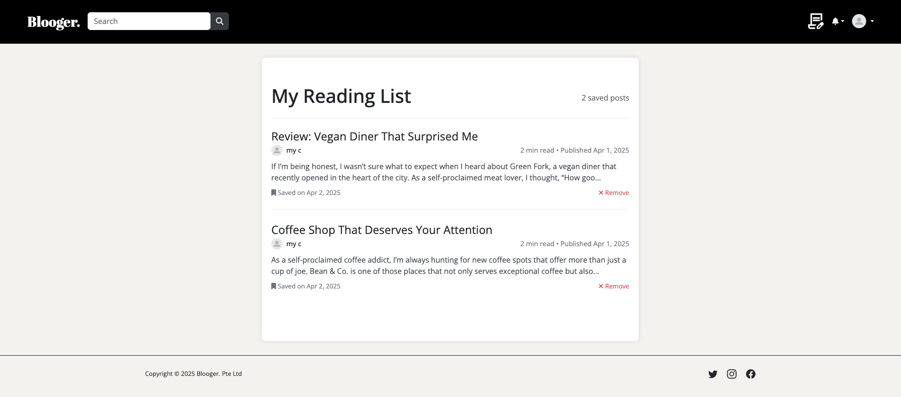

# 📝 Blooger Web Application

**Blooger** is a fully functional blog web application developed using the **LAMP stack** (Linux, Apache, MySQL, PHP) as part of a Web Systems & Technology school project. The goal was to explore full-stack development and implement essential features of a dynamic blog platform, while incorporating real-world tools and principles in system architecture, design, and usability.

---

## 🔍 Project Walkthrough

### 🔐 User Authentication, Verification & Password Reset
Blooger features a secure user registration and login system. New users are required to verify their accounts through an email link sent via **PHPMailer**, ensuring the platform remains protected from spam accounts. Passwords are encrypted before storage, and session handling ensures secure user logins. A secure password reset feature is also available, allowing users to request a reset link via email and update their password through a verified process.

### 📝 Blog Post Management
Users can create, edit, and delete blog posts through an intuitive interface. Posts are stored in a MySQL database and linked to their respective users. Each post includes a title, body content, timestamps, and supports HTML formatting for a rich reading experience.

### 💬 Engagement & Social Features
Every post supports interaction through a like and comment system. Users can like posts, leave comments, and participate in threaded discussions. Additionally, a followers and following system helps users build connections by generating a personalised feed based on who they follow.

### 👤 Profile Customisation & Real-Time Notifications
Users can personalise their profiles with profile pictures, bios, and other details that enhance their identity within the platform. To keep users updated, Blooger includes real-time notifications for key actions such as likes, comments, follows, and post translations—ensuring they never miss a moment of interaction.

### 🌐 Multi-language Translation (Powered by OpenAI)
An innovative feature of Blooger is its integration with the **OpenAI API** to provide translation of blog posts into different languages. Users can click to translate a post, and the translated content is dynamically fetched and displayed alongside the original, broadening accessibility and inclusivity.

### 🛠️ Admin Dashboard
The platform includes a comprehensive admin panel that allows administrators to:
- View and manage all users
- Review, edit, or delete posts
- Moderate reported content
- Reset user passwords or deactivate accounts

This dashboard ensures that the platform remains clean, organised, and user-friendly.

### 🎨 Responsive Design
Blooger is styled using **Bootstrap 5**, ensuring a responsive and consistent interface across different screen sizes. The layout is designed for clarity, with clean navigation and mobile compatibility.

---

## ⚙️ Technologies Used
- **PHP** – Backend logic and API integration
- **MySQL** – Data storage and management
- **PHPMailer** – Email verification system
- **OpenAI API** – Translation feature
- **Bootstrap 5** – Frontend styling and responsiveness

---

## 📌 Future Improvements
- Category-based filtering and personalised post recommendations
- Support for multimedia content, including images and videos to enrich posts
- Optimise query performance for scalability
- Implement advanced user analytics for admins

---

## 🙏 Acknowledgements
- Built as part of the Web Systems & Technology module at Singapore Institute of Technology
- Thanks to our lecturer and teaching assistant for their guidance and feedback, as well as to my groupmates for their contributions.

---

## 📸 Screenshots

> A visual overview of the Blooger web application in action.

---

### 🏠 Home Page  
  
Welcome screen with navigation options for registration, login, and exploring public posts.

---

### 📖 About Us Page  
  
Overview of the platform’s mission and functionality, introducing users to the purpose of Blooger.

---

### 🔐 Logged-In Dashboard  
  
Main landing page for logged-in users, featuring quick access to the feed, post creation, and notifications.

---

### 👤 User Profile Page  
  
View and edit profile information including display picture, bio, and user stats like followers and following.

---

### 👥 Follower & Following System  
  
Users can follow others, build their own social feed, and view mutual connections.

---

### 🛠️ Admin Dashboard  
  
Admin panel with options to moderate content, manage users, and view platform statistics.

  
Detailed controls for administrators to deactivate users, reset passwords, or review reported content.

---

### 💳 Payment Integration Page  
  
Prototype interface for handling in-app payments, subscriptions, or donation support.

---

### 📝 Post Detail View  
  
View a full blog post, with translation options, comments, and like functionality.

---

### 📚 Reading List Feature  
  
Users can save posts to their personal reading list for quick access and offline reference.
